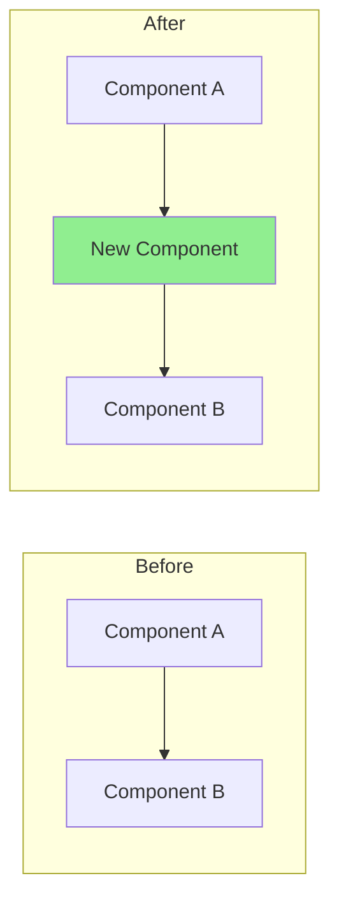

## Summary

<!-- Brief 1-2 sentence description of what this PR does and why -->

## Type of Change

- [ ] 🆕 Feature (new functionality)
- [ ] 🐛 Bug fix (fixes an issue)
- [ ] ♻️ Refactor (code restructuring, no behavior change)
- [ ] 📚 Documentation
- [ ] 🗃️ Data / Seed changes
- [ ] ⚙️ Configuration / CI

## Changes

### What changed

<!-- Bullet list of the key changes, grouped by component -->

### Why

<!-- Motivation, context, or linked issue (e.g., Fixes #123) -->

## How Has This Been Tested?

- [ ] `mvn compile` passes
- [ ] `npm run build` passes
- [ ] Manual testing (describe below)
- [ ] Unit / integration tests

<!-- Describe any manual testing steps -->

## Architecture Diagram (if applicable)

<!-- For structural changes, include a before/after Mermaid diagram:

-->

## Review Checklist

- [ ] Self-review completed
- [ ] No hardcoded credentials or secrets
- [ ] No `System.out.println` / `console.log` debugging left
- [ ] No breaking API changes (or documented if intentional)
- [ ] Complex logic is commented

## Screenshots / Recordings (if applicable)

<!-- Paste screenshots or screen recordings for UI changes -->
