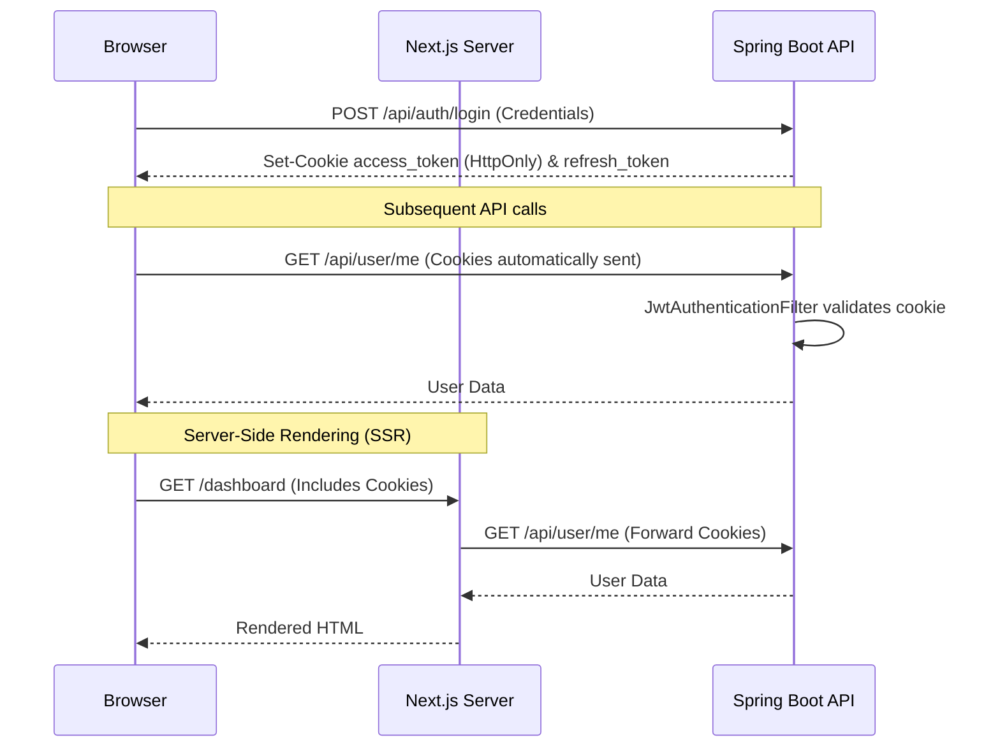

# DailyEng

An AI-powered, full-stack English Learning Platform designed for interactive learning, pronunciation assessment, and spaced repetition (FSRS). The application is built with a decoupled architecture featuring a modern React frontend and a robust Java backend.

## Key Features

- **Interactive Speaking Practice**: Real-time speech-to-text, text-to-speech, and pronunciation assessment using Azure Speech AI.
- **FSRS Spaced Repetition**: Advanced vocabulary retention using the Free Spaced Repetition Scheduler algorithm with personalized weight optimization.
- **Placement Testing & Study Plans**: Adaptive English level testing and automated generation of personalized study schedules.
- **Grammar & Vocabulary Notebooks**: Personalized learning material tracking with AI-generated examples and explanations.
- **Comprehensive Dashboard**: XP tracking, study streaks, daily tasks, and progress analytics.

---

## Tech Stack

The application uses a separated frontend/backend architecture:

### Frontend
- **Framework**: Next.js 15 (App Router, React 19)
- **Styling**: Tailwind CSS v4, Framer Motion, Anime.js, React Three Fiber (3D)
- **UI Components**: Radix UI (shadcn/ui), Lucide React
- **State Management**: Zustand, React Hook Form
- **Language**: TypeScript

### Backend
- **Language**: Java 21
- **Framework**: Spring Boot 3.4
- **Database**: PostgreSQL 16
- **Database Migrations**: Flyway
- **Authentication**: JWT (JSON Web Tokens) with HttpOnly cookies, Google OAuth 2.0
- **AI Integrations**: Azure Cognitive Services (Speech), Google Gemini (Generative AI)
- **Build Tool**: Maven

---

## Prerequisites

Before starting, ensure you have the following installed:

- **Node.js**: v20 or higher
- **Java**: JDK 21
- **Maven**: 3.9+
- **PostgreSQL**: 15 or higher (or Docker)
- **Azure Account**: For Speech services (TTS/STT/Pronunciation Assessment)
- **Google Cloud Platform Account**: For OAuth and Gemini AI (optional but recommended)

---

## Getting Started

### 1. Clone the Repository

```bash
git clone https://github.com/your-username/DailyEng-java.git
cd DailyEng-java
```

### 2. Database Setup

Start a local PostgreSQL instance. Using Docker is the easiest way:

```bash
docker run --name dailyeng-postgres \
  -e POSTGRES_USER=postgres \
  -e POSTGRES_PASSWORD=postgres \
  -e POSTGRES_DB=dailyeng \
  -p 5432:5432 \
  -d postgres:16
```

### 3. Backend Setup (Spring Boot)

Navigate to the backend directory:

```bash
cd backend
```

Copy the example environment file and configure it:

```bash
cp .env.example .env
```

Review the `.env` file and configure the necessary variables. At a minimum, ensure your database connection is correct:

```properties
SPRING_DATASOURCE_URL=jdbc:postgresql://localhost:5432/dailyeng
SPRING_DATASOURCE_USERNAME=postgres
SPRING_DATASOURCE_PASSWORD=postgres

# Generate a strong 32+ character JWT secret
JWT_SECRET=your_super_secret_jwt_key_here_make_it_long
```

Run the application (this will automatically apply Flyway migrations):

```bash
mvn spring-boot:run
```

The backend API will start on `http://localhost:8080`.

### 4. Frontend Setup (Next.js)

Open a new terminal and navigate back to the project root:

```bash
cd ..
```

Install dependencies:

```bash
npm install
# or
yarn install
```

Copy the environment file:

```bash
cp .env.local.example .env.local
# or if .env.example exists:
cp .env.example .env.local
```

Ensure the API URL points to your local backend:

```env
NEXT_PUBLIC_API_URL=http://localhost:8080/api
```

Start the development server:

```bash
npm run dev
# or 
yarn dev
```

Open [http://localhost:3000](http://localhost:3000) in your browser to see the application.

---

## Architecture

### Directory Structure

``` text
DailyEng-java/
├── backend/                     # Spring Boot Application
│   ├── src/main/java/com/dailyeng/
│   │   ├── config/              # Spring configurations (CORS, Properties)
│   │   ├── controller/          # REST API endpoints
│   │   ├── dto/                 # Data Transfer Objects (Java Records)
│   │   ├── entity/              # JPA Entities (Database mapping)
│   │   ├── exception/           # Global exception handling
│   │   ├── repository/          # Spring Data JPA repositories
│   │   ├── security/            # JWT filters and auth configuration
│   │   └── service/             # Business logic layer
│   └── src/main/resources/
│       ├── application.yml      # Spring Boot properties
│       └── db/migration/        # Flyway SQL migration scripts (V1 -> V10)
│
├── src/                         # Next.js Application
│   ├── app/                     # Next.js App Router pages and layouts
│   ├── actions/                 # Server actions for API communication
│   ├── components/              # Reusable React components
│   │   ├── auth/                # Sign-in/up components
│   │   ├── dashboard/           # Dashboard UI
│   │   ├── speaking/            # Audio recording and assessment UI
│   │   └── ui/                  # Base Radix/shadcn components
│   ├── contexts/                # React Context providers (Auth, etc.)
│   ├── hooks/                   # Custom React hooks (useAudioRecorder, etc.)
│   ├── lib/                     # Utilities (apiClient, formatters)
│   └── types/                   # TypeScript interfaces
│
├── public/                      # Static assets (images, fonts, 3d models)
├── components.json              # shadcn/ui configuration
├── next.config.mjs              # Next.js configuration
└── package.json                 # Node dependencies
```

### Request Lifecycle

1. **User Action**: User interacts with a React component (e.g., submits an audio recording).
2. **Frontend API Call**: A Server Action or client-side fetch uses the `apiClient` (`src/lib/api-client.ts`) to make an HTTP request.
3. **Authentication**: The `apiClient` automatically attaches the HttpOnly `access_token` cookie (or forwards it during Server SSR).
4. **Backend Security**: Spring Security (`JwtAuthenticationFilter`) validates the JWT and sets the `SecurityContext`.
5. **Controller Layer**: A Spring `RestController` receives the request, validates the DTO automatically using `@Valid`, and delegates to a Service.
6. **Service Layer**: The `Service` executes business logic (e.g., calling Azure Speech SDK or running FSRS algorithm).
7. **Database Interaction**: The Service uses a `Repository` to read/write JPA Entities to PostgreSQL.
8. **Response**: The Controller returns a DTO mapped to JSON, which the frontend renders.

### Data Model Highlights

- **User**: Core identity, linked to Accounts (OAuth), ProfileStats (XP/Streak), and Sessions.
- **SiteContent**: Flexible JSONB storage for CMS-like data (FAQs, reviews, grammar samples).
- **SpeakingSession / SpeakingTurn**: Tracks multi-turn conversational AI sessions with detailed scoring (Azure Speech).
- **VocabItem**: Tracks individual vocabulary knowledge using FSRS (Free Spaced Repetition Scheduler) markers (stability, difficulty, retrievability).
- **StudyPlan / StudyTask**: Manages personalized daily learning goals.

---

## Environment Variables

### Backend (`backend/.env`)

| Variable | Description | Example |
| -------- | ----------- | ------- |
| `SPRING_DATASOURCE_URL` | PostgreSQL JDBC connection string | `jdbc:postgresql://localhost:5432/dailyeng` |
| `SPRING_DATASOURCE_USERNAME` | Database username | `postgres` |
| `SPRING_DATASOURCE_PASSWORD` | Database password | `postgres` |
| `JWT_SECRET` | Secret key for signing JWTs | (32+ character random string) |
| `GOOGLE_CLIENT_ID` | For Google OAuth login | `123-abc.apps.googleusercontent.com` |
| `AZURE_SPEECH_KEY` | Azure Cognitive Services key | `xyz123...` |
| `AZURE_SPEECH_REGION` | Azure region | `eastus` |
| `GEMINI_API_KEY` | Google Gemini API key | `AIzaSy...` |

### Frontend (`.env.local`)

| Variable | Description | Example |
| -------- | ----------- | ------- |
| `NEXT_PUBLIC_API_URL` | Base URL for the Spring Boot backend | `http://localhost:8080/api` |
| `NEXT_PUBLIC_APP_URL` | The URL where the frontend is hosted | `http://localhost:3000` |

---

## Available Scripts

### Frontend (Root directory)

| Command | Description |
| ------- | ----------- |
| `npm run dev` | Starts the Next.js development server |
| `npm run build` | Builds the Next.js application for production |
| `npm run start` | Starts the production server |
| `npm run lint` | Runs ESLint to check for code issues |
| `npm run test` | Runs the Vitest test suite |

### Backend (`/backend` directory)

| Command | Description |
| ------- | ----------- |
| `mvn spring-boot:run` | Runs the Spring Boot application |
| `mvn compile` | Compiles the Java code |
| `mvn test` | Runs the JUnit test suite |
| `mvn clean package` | Builds the executable `.jar` file for production |

---

## Deployment

The application consists of a statically built (or Node-hosted) frontend and a Java backend. They can be deployed separately.

### Backend (Spring Boot)

The backend compiles into a standalone executable JAR.

1. Build the production JAR:
   ```bash
   cd backend
   mvn clean package -DskipTests
   ```
2. The executable will be located at `backend/target/dailyeng-api-0.1.0.jar`.
3. Deploy this JAR to a VPS (using systemd), AWS Elastic Beanstalk, Render (Web Service using Docker or Java environment), or Heroku.
4. Ensure the production PostgreSQL database is accessible and environment variables (JWT secret, API keys) are set. Flyway will automatically migrate the database on startup.

### Frontend (Next.js)

The frontend is optimized for deployment on Vercel.

1. Connect your GitHub repository to Vercel.
2. Set the Framework Preset to "Next.js".
3. Set the Root Directory to the project root (if not automatically detected).
4. Add the `NEXT_PUBLIC_API_URL` environment variable pointing to your deployed backend.
5. Deploy.

Alternatively, you can build a Docker image for the frontend using the standard Next.js Dockerfile template.

---

## System Architecture Diagrams

### Authentication Flow (JWT in HttpOnly Cookies)


