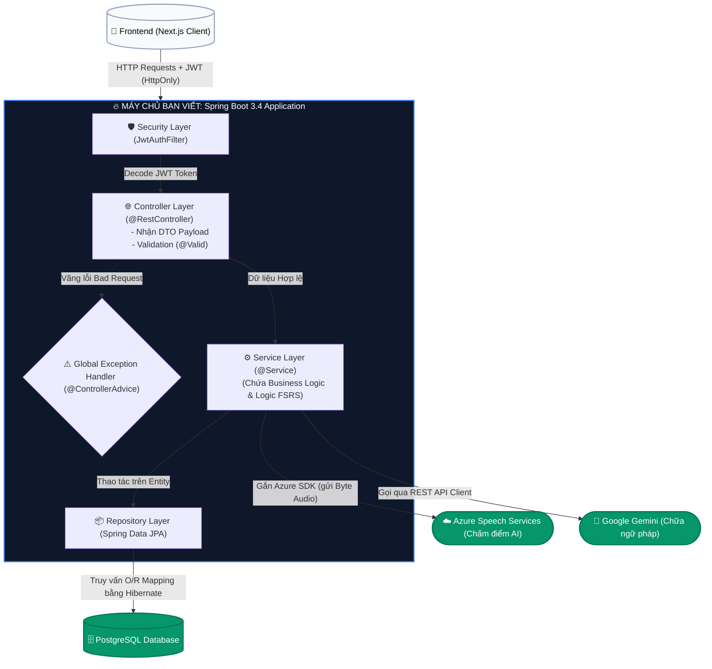

# Báo Cáo Đồ Án: Ứng Dụng Học Tiếng Anh DailyEng (Java Spring Boot + Next.js)

Dưới đây là cấu trúc báo cáo chi tiết, được tinh chỉnh dành riêng cho môn **Công Nghệ Java**. Cấu trúc này làm nổi bật kiến trúc Backend, cách thao tác với Java Spring Boot, áp dụng OOP, tích hợp AI, bảo mật và tương tác cơ sở dữ liệu.

---

## CHƯƠNG 1: TỔNG QUAN ĐỀ TÀI
*(Gợi ý chung: Chương này giải thích lý do thực hiện dự án và mục tiêu hướng tới, đóng vai trò như một lời giới thiệu tổng quát).*

**1.1. Bối cảnh và lý do chọn đề tài:** 
Vai trò của tiếng Anh hiện nay, sự thiếu hụt môi trường thực hành nói, và tiềm năng của việc ứng dụng AI (Azure, Gemini) để chấm điểm/chữa lỗi. 
*Gợi ý cách viết:* Trình bày ngắn gọn mô hình AS-IS (người dùng tự học khó tìm lỗi sai phát âm, đi trung tâm thì tốn kém) và Mô hình TO-BE (dùng AI trên DailyEng làm trợ lý ngôn ngữ để phân tích tiếng Anh và chữa lỗi ngay lập tức). Nêu bật sự đóng góp của AI.

**1.2. Mục tiêu:**
*   **Mục tiêu kiến thức:** Nắm vững cấu trúc và cách vận hành một hệ thống phân tán (Client-Server), hiểu sâu các core features của Java 21, Spring Boot 3.4, Dependency Injection, JPA/Hibernate, Spring Security.
*   **Mục tiêu sản phẩm:** Xây dựng nền tảng học tiếng Anh độc lập (Decoupled Architecture), bao gồm tính năng tự học FSRS (Spaced Repetition) và luyện nói phản xạ với AI.

**1.3. Bố cục báo cáo đồ án:** 
Tóm tắt ngắn gọn các chương tiếp theo.

---

## CHƯƠNG 2: CƠ SỞ LÝ THUYẾT VÀ CÔNG NGHỆ SỬ DỤNG
*(Gợi ý chung: Chương này không nên viết quá dài về lý thuyết suông. Hãy chỉ liệt kê những công nghệ cốt lõi và giải thích rõ **TẠI SAO NGƯỜI LẬP TRÌNH (BẠN)** lại chọn nó vào dự án).*

**2.1. Backend (Trọng tâm - Viết thật sâu phần này để lấy điểm cao):**
*   **2.1.1. Nền tảng ngôn ngữ Java 21:** Nêu ra việc dùng các tính năng ngôn ngữ hiện đại. *Gợi ý:* Chú trọng việc bạn sử dụng **Java Records** cho các Object truyền tải DTO để mã nguồn ngắn gọn, tối ưu bộ nhớ và an toàn luồng dữ liệu (Immutable).
*   **2.1.2. Spring Boot 3.4:** Core của hệ thống backend. *Yêu cầu:* Giải thích sơ bộ cơ chế IoC (Inversion of Control) và Dependency Injection (DI) thực hiện thông qua những Annotation nào (`@Service`, `@RestController`).
*   **2.1.3. Cấu hình ORM với Spring Data JPA & Hibernate:** Cơ chế mapping tự động biến bảng CSDL thành Java Entity nhằm truy vấn không cần lệnh SQL raw.
*   **2.1.4. Bảo mật với Spring Security & JWT:** *Điểm ăn tiền:* Nêu rõ việc hệ thống từ chối dùng Session truyền thống (để cho stateless), kết hợp tạo JWT được đóng vào **HttpOnly Cookies**, cùng với Google OAuth 2.0 chống mọi cuộc tấn công lấy cắp token XSS.

**2.2. Cơ sở dữ liệu:** 
PostgreSQL 16 và quy trình Quản lý vòng đời DB (Database Migrations) bằng **Flyway**. *Gợi ý:* Hãy nói về cách Flyway tự động khởi tạo các bảng (`V1__init.sql`) khi chạy app Java giúp làm việc nhóm dễ dàng mà không cãi nhau về file SQL.

**2.3. Tích hợp bên thứ ba (3rd Party SDKs & Tools):** 
*   **2.3.1. Phân tích phát âm (Azure Speech SDK):** Dịch vụ nhận diện giọng nói (Speech-to-Text) và chấm điểm phát âm (Pronunciation Assessment) mức độ từ vựng/âm vị.
*   **2.3.2. Trợ lý ngôn ngữ AI (Google Gemini API):** Được BE nạp hệ thống Prompt đặc thù để phân tích câu văn người dùng nói, từ đó chỉ ra lỗi sai ngữ pháp, đánh giá độ lưu loát và gọi ý phản hồi tự nhiên.
*   **2.3.3. Sentry (Giám sát ứng dụng):** Nền tảng giám sát ứng dụng (Application Monitoring). *Gợi ý:* Hãy ghi chú rằng nhóm dùng Sentry để bắt các lỗi Runtime Exception tự động trên Production thay vì phải đọc file log txt thủ công.
*   **2.3.4. Resilience4j & Caffeine Cache (Tối ưu hiệu năng & Chịu lỗi):** *Gợi ý:* Chèn thêm ý dùng Caffeine để cache dữ liệu tĩnh tốc độ cao trong RAM, và Resilience4j làm Circuit Breaker bảo vệ server không bị sập khi gọi API của Azure/Gemini bị nghẽn mạng.

**2.4. Frontend:** 
Framework Next.js 15, Framer Motion (Phần này đi lướt qua để giáo viên nắm là có giao diện).

---

## CHƯƠNG 3: PHÂN TÍCH VÀ THIẾT KẾ HỆ THỐNG
*(Gợi ý chung: Đây là chương **QUAN TRỌNG NHẤT** về mặt học thuật của Kĩ Thuật Phần Mềm. Cần tập hợp các sơ đồ để minh chứng dự án đã được thiết kế bài bản trước khi triển khai thành code).*

**3.1. Phân tích yêu cầu hệ thống**
*   **3.1.1. Yêu cầu chức năng:** Quản lý tài khoản, Thu âm & Phân tích phát âm, Lưu trữ và ôn tập Vocab bằng FSRS, Chấm điểm logic AI.
*   **3.1.2. Yêu cầu phi chức năng:** Thời gian xử lý logic phản hồi nhanh (dù phải móc nối AI), Stateless authentication, Xử lý tệp tin (audio input bytes) hiệu quả trong code Java.

**3.2. Phân tích Use Case và Thiết kế Luồng nghiệp vụ**
*   **3.2.1. Biểu đồ Use Case tổng quát:** 
    *   `[📌 CHÈN SƠ ĐỒ USE CASE TẠI ĐÂY]` *(Thể hiện 2 Actor chính: User và Admin/System, đi kèm các bong bóng Use Case: OAuth Login, Luyện phát âm, Học thẻ bài Flashcard, Sync data...)*
*   **3.2.2. Đặc tả Workflow các chức năng cốt lõi (Vẽ biểu đồ Sequence):** 
    *   `[📌 CHÈN SƠ ĐỒ TUẦN TỰ 1: LUỒNG BẢO MẬT ĐĂNG NHẬP JWT HTTP-ONLY]` *(Trong README có sẵn sơ đồ luồng này. Từ frontend qua AuthFilter JWT của Java trả về cookie)*.
    *   `[📌 CHÈN SƠ ĐỒ TUẦN TỰ 2: LUỒNG LÕI THU ÂM AI LUYỆN NÓI]` *(Trình bày quy trình: Client gửi Audio File -> Request đi xuyên qua SecurityContext -> Controller nhận biến dạng MultipartFile -> Interface Service truyền byte stream cho Azure Speech -> Tùy chỉnh JSON AI xử lý lỗi grammar -> Trả DTO API kết quả về Frontend).*

**3.3. Thiết kế cơ sở dữ liệu**
*   **3.3.1. Sơ đồ thực thể kết hợp (ERD):** 
    *   `[📌 CHÈN SƠ ĐỒ ERD CƠ SỞ DỮ LIỆU TẠI ĐÂY]` *(Bao quát các bảng: Users, VocabItem, SpeakingSession, SpeakingTurn. Chú ý ký hiệu One-to-Many cho chuẩn).*
*   **3.3.2. Cấu trúc các bảng chính:** *Điểm ăn tiền:* Hãy đề cập đến việc bạn tận dụng kiểu dữ liệu cột là `JSONB` trong bảng `SiteContent` hoặc một số meta-data của User của CSDL PostgreSQL để linh hoạt lưu dữ liệu phi cấu trúc mà không cần lạm dụng tạo thêm hàng loạt Table con cực nhọc.

**3.4. Mô hình kiến trúc hệ thống (System Architecture)**
*   **3.4.1. Kiến trúc tổng quan: Mô hình Client – Server:** Sinh viên phân tích rằng hệ thống dự án đã được thiết kế theo cấu trúc Client-Server tách bạch hoàn toàn. Khối Client (Next.js) thuần túy chịu trách nhiệm tương tác và kết xuất giao diện người dùng. Khối Server (Spring Boot Java) nằm độc lập trên một cụm máy chủ khác phục vụ RESTful API. Mô hình độc lập này giúp tăng tính bảo mật, và tương lai dễ dàng cắm thêm nền tảng di động (Mobile App) dùng chung cục Backend mà không phải viết lại code.
*   **3.4.2. Kiến trúc phân tầng Backend (Layered Architecture):**
Sơ đồ dưới đây mô phỏng sâu vào thiết kế bên trong lòng khối máy chủ Java Backend. Nó quy định chặt chẽ dòng chảy của dữ liệu: Phải lọt qua Tầng lọc Bảo mật, đến Tầng Điều phối (Controller), xử lý thuật toán tại Tầng Nghiệp vụ (Service), rồi mới lưu xuống DB hoặc gọi các SDK Trí tuệ Nhân tạo.

*(Gợi ý Trình bày: Hãy nói với hội đồng rằng Kiến trúc của bạn tuân thủ chặt chẽ nguyên lý Separation of Concerns (Tách biệt mối quan tâm). Luồng Request bắt buộc đi qua `JwtAuthFilter` để chặn chặn kết nối bẩn trước khi vào `Controller`. Các Service Layer ẩn giấu hoàn toàn tính toán FSRS và việc gọi API bên thứ ba, chỉ trả DTO sạch ngược về Client).*
**3.5. Thiết kế hướng đối tượng (Object-Oriented Design) và Design Pattern**
*(Gợi ý chung: Trọng tâm của mục này là chứng minh nhóm đã DÙNG TƯ DUY OOP ĐỂ GIẢI QUYẾT BÀI TOÁN THỰC TẾ của hệ thống, tuân thủ đúng giai đoạn "Thiết kế" trước khi gõ mã nguồn).*
*   **3.5.1. Thiết kế cấu trúc hướng đối tượng:**
    *   **Tính đóng gói (Encapsulation) qua DTO:** Đặt ra bài toán thực tế là dữ liệu User/Bài học chứa nhiều thông tin hệ thống nhạy cảm (mật khẩu, siêu dữ liệu). Chiến lược thiết kế là giấu hoàn toàn thiết kế của Entity database. Giao thức giao tiếp với Client bên ngoài bắt buộc được Đóng gói (encapsulate) thành các Data Transfer Object (DTO) (ưu tiên DTO kiểu `Record` của Java 21). Việc này giúp cấu trúc Object trả về luôn có kết cấu gọn nhẹ, ẩn đi dữ liệu tối mật.
    *   **Tính trừu tượng (Abstraction) qua Interface:** Chức năng Luyện phát âm (Speaking) bị phụ thuộc chặt vào bên thứ 3 (Azure, Gemini). Để hệ thống không bị "chết cứng", kiến trúc thiết kế yêu cầu các module nghiệp vụ giao tiếp chéo thông qua các **Interface Hợp đồng (Contract Service)**. Sự trừu tượng hóa này mang lại sự đa hình hoàn hảo, giả sử tương lai dự án muốn đổi Gemini sang dòng AI khác, chỉ cần tạo 1 class `Impl` mới kế thừa Interface đó mà không làm sụp đổ các Controller đang gọi nó.
    *   `[📌 CHÈN SƠ ĐỒ: CLASS DIAGRAM — Thể hiện quan hệ giữa các class chính: Controller → Service Interface → ServiceImpl, Entity ↔ DTO (Record), Repository interface]`
*   **3.5.2. Áp dụng mẫu thiết kế (Design Pattern): Global Exception** 
    *   *Bài toán:* Khi phía Frontend gửi file Audio bị lỗi định dạng, hoặc phiên JWT bị hết hạn, hệ thống cần gửi thông báo lỗi chuẩn thay vì làm văng mã HTML khó hiểu gây sập web.
    *   *Chiến lược thiết kế Pattern:* Thiết kế theo mô hình Xử lý ngoại lệ tập trung (Centralized Exception Handling). Định nghĩa sẵn một `Object Error Response` quy chuẩn cho mọi loại lỗi định dạng. Một tầng đánh chặn trung gian sẽ đứng giữa để tự động bọc (wrap) mọi Exception (từ NullPointer tới BadAuth) rồi đóng nó dưới dạng mã nguồn JSON thân thiện có mã code HTTP (400, 401, 403) một cách tự động bám theo Design Pattern.

**3.6. Thiết kế API Protocol và giao thức giao tiếp**
*(Lưu ý: Đây là mục THIẾT KẾ — thuộc Chương 3, viết trước khi code. Nhiệm vụ là chứng minh nhóm đã có tư duy thiết kế hệ thống API bài bản. **KHÔNG** chèn ảnh Swagger hay Postman ở đây — các bằng chứng kết quả đó thuộc về mục 4.4.1.)*

*   **Hình thức trình bày:** Dùng **bảng thiết kế API** tổng quan, nhóm theo chức năng (Auth, Speaking, Vocab, User...). Mỗi hàng gồm: `Method` | `Endpoint` | `Mô tả ngắn` | `Yêu cầu Auth?`

    *Ví dụ mẫu bảng:*

    | Nhóm | Method | Endpoint | Mô tả | Auth |
    |---|---|---|---|---|
    | Auth | POST | `/api/auth/login` | Đăng nhập, trả JWT Cookie | ❌ |
    | Auth | POST | `/api/auth/register` | Tạo tài khoản | ❌ |
    | Auth | POST | `/api/auth/google` | Đăng nhập Google OAuth 2.0 | ❌ |
    | Speaking | POST | `/api/speaking/analyze` | Gửi audio, nhận kết quả AI | ✅ |
    | Speaking | GET | `/api/speaking/sessions` | Lịch sử phiên luyện nói | ✅ |
    | Vocab | GET | `/api/vocab/decks` | Danh sách bộ thẻ từ vựng | ✅ |
    | Vocab | POST | `/api/vocab/review` | Gửi đánh giá FSRS | ✅ |
    | User | GET | `/api/user/profile` | Lấy thông tin cá nhân | ✅ |
    | User | PUT | `/api/user/profile` | Cập nhật thông tin | ✅ |
    | ... | ... | *(Bổ sung toàn bộ endpoint thực tế)* | ... | ... |

*   **Hai điểm thiết kế nổi bật cần giải thích bằng chữ:**
    1.  **Quy chuẩn RESTful naming:** Giải thích tại sao dùng danh từ số nhiều (`/api/vocab/decks`) và động từ HTTP thay thế cho tên hành động trong URL. Ví dụ: `DELETE /api/vocab/{id}` thay vì `/api/deleteVocab`.
    2.  **Hai loại Content-Type khác nhau:** So sánh `multipart/form-data` dùng cho endpoint nhận file audio (Speaking) với `application/json` dùng cho các endpoint nhận dữ liệu text thông thường — lý do kỹ thuật đằng sau sự khác biệt này.

**3.7. Thiết kế giao diện người dùng (UI/UX)**
*   Chỉ cần tóm tắt bằng chữ rằng sản phẩm đã được wrap bởi React/Tailwind CSS tối ưu với định hướng Single-page app/SSR để thầy cô hiểu có frontend đàng hoàng.

---

## CHƯƠNG 4: HIỆN THỰC HÓA VÀ TRIỂN KHAI HỆ THỐNG
*(Gợi ý: Chương này thể hiện tài liệu về năng lực code Java thực tế và kĩ năng DevOps Deploy. Phần 4.2 là trọng tâm — cần dán code thật, giải thích kỹ để chứng minh đã hiện thực hóa thiết kế ở Chương 3.)*

**4.1. Môi trường phát triển (Development Environment)**
*   **4.1.1. Công cụ soạn thảo mã nguồn (IDE/Editor):** IntelliJ IDEA (Backend) vs VS Code (Frontend). Môi trường CSDL bằng Docker Container cấu hình port 5432.
*   **4.1.2. Công cụ quản lý thư viện (Build System):** Cấu hình và quản lý vòng đời thông qua file `pom.xml` của Maven.
*   **4.1.3. Cấu trúc thư mục dự án (Project Structure):**
    *   `[📌 CHÈN ẢNH: CÂY THƯ MỤC src/main/java/com/dailyeng/ TRONG INTELLIJ]`
    *   *Gợi ý:* Chụp cây thư mục project trong IntelliJ, thể hiện cách tổ chức package theo module nghiệp vụ: `auth/`, `srs/`, `vocabulary/`, `grammar/`, `speaking/`, `notebook/`, `studyplan/`, `config/`, `common/`. Giải thích ngắn rằng mỗi package chứa đầy đủ Controller + Service + Repository + DTO riêng biệt — tuân thủ nguyên tắc Separation by Feature.

**4.2. Hiện thực mã nguồn các module lõi**

Hệ thống backend DailyEng được tổ chức thành **15 package nghiệp vụ độc lập**: `auth`, `speaking`, `srs`, `vocabulary`, `grammar`, `ai`, `xp`, `dorara` (StarLens), `notebook`, `notification`, `studyplan`, `content`, `user`, `config`, `common`. Mỗi package chứa đầy đủ Controller, Service, Repository và DTO riêng biệt. Dưới đây là **5 module tiêu biểu nhất** được chọn trình bày chi tiết vì có độ phức tạp kỹ thuật Java cao nhất:

*   *Yêu cầu báo cáo: Mỗi mục con cần có ít nhất 1 đoạn code Java thật (screenshot hoặc code block) kèm giải thích ngắn. Đây là phần ĂN ĐIỂM NHẤT của Chương 4.*

*   **4.2.1. Module xác thực và phân quyền (Authentication & Security):**
    Cài đặt `JwtAuthFilter` extends `OncePerRequestFilter` để chặn và giải mã JWT từ HttpOnly Cookie ở mọi request. Cấu hình `SecurityFilterChain` Bean quy định endpoint nào public (`/api/auth/**`), endpoint nào yêu cầu xác thực. Cấu hình Cross-Origin Resource Sharing (CORS) cho phép Frontend tách bạch giao tiếp.
    *   `[📌 CHÈN ẢNH CODE: JwtAuthFilter.java — đoạn doFilterInternal()]`
    *   `[📌 CHÈN ẢNH CODE: SecurityConfig.java — đoạn SecurityFilterChain Bean]`

*   **4.2.2. Module luyện phát âm AI (Speaking Room):**
    Đây là module phức tạp nhất của hệ thống. `SpeakingController` nhận file audio dạng `MultipartFile`, chuyển thành `byte[]` rồi điều phối sang `SpeakingService`. Service gọi **Azure Speech SDK** để lấy Pronunciation Assessment (chấm điểm từng phoneme) và gọi **Google Gemini API** để phân tích ngữ pháp câu nói. Kết quả được tổng hợp thành DTO chuẩn trả về Frontend.
    *   `[📌 CHÈN ẢNH CODE: SpeakingService.java — đoạn gọi Azure SDK (SpeechConfig, PronunciationAssessment)]`
    *   `[📌 CHÈN ẢNH CODE: GeminiService.java — đoạn build prompt và parse JSON response]`

*   **4.2.3. Module thuật toán FSRS (Spaced Repetition):**
    Code tính toán tham số hệ số lặp lại ngắt quãng (FSRS-4.5 algorithm) hoàn toàn đảm nhận trong lớp `FsrsAlgorithm.java` của Backend. Hàm `schedule()` nhận vào trạng thái thẻ hiện tại (stability, difficulty, state) và mức đánh giá của người dùng (Again/Hard/Good/Easy), trả về trạng thái mới kèm ngày ôn tập tiếp theo. Frontend không hề can thiệp logic này để ngăn gian lận.
    *   `[📌 CHÈN ẢNH CODE: FsrsAlgorithm.java — đoạn hàm schedule() hoặc retrievability()]`

*   **4.2.4. Module từ vựng và ngữ pháp (Vocabulary & Grammar):**
    `VocabService` quản lý vòng đời thẻ từ vựng: tạo mới, lấy danh sách thẻ đến hạn ôn tập, và trigger thuật toán FSRS khi người dùng review. Entity `UserVocabProgress` mapping sang bảng PostgreSQL thông qua JPA annotation (`@Entity`, `@ManyToOne`, `@Column`). Grammar module cung cấp nội dung bài học được lưu trữ dưới dạng `JSONB` linh hoạt.
    *   `[📌 CHÈN ẢNH CODE: VocabService.java — đoạn xử lý review và gọi FSRS]`
    *   `[📌 CHÈN ẢNH CODE: UserVocabProgress.java — Entity với JPA annotations]`

*   **4.2.5. Module hệ thống XP và bảng xếp hạng (Gamification):**
    Hệ thống tích điểm kinh nghiệm (XP) được xây dựng để tạo động lực học tập. `XpService` tính toán và cộng XP mỗi khi người dùng hoàn thành phiên luyện nói, ôn tập flashcard, hoặc hoàn thành nhiệm vụ hàng ngày (`DailyMission`). Entity `UserActivity` ghi lại lịch sử hoạt động theo ngày để tính streak liên tục. `LeaderboardService` tổng hợp bảng xếp hạng toàn hệ thống dựa trên XP tích lũy — truy vấn được tối ưu bằng JPA Repository với phân trang (`Pageable`).
    *   `[📌 CHÈN ẢNH CODE: XpService.java — đoạn tính XP và cập nhật streak]`
    *   `[📌 CHÈN ẢNH CODE: LeaderboardService.java — đoạn truy vấn bảng xếp hạng]`

**4.3. Vận hành và triển khai đám mây (Cloud Deployment & CI/CD)**
*Gợi ý cách viết: Đừng chỉ liệt kê tên nền tảng, hãy mô tả ngắn quy trình bạn đẩy code lên mạng.*
*   **4.3.1. Thiết lập quy trình CI/CD (GitHub Actions):** Tự động hóa quá trình chạy Test và Upload Source Map lên **Sentry** mỗi khi có code mới được Merge vào nhánh chính (`main`).
*   **4.3.2. Đóng gói thực thi JVM (Artifact Build):** Cơ chế compiler `mvn clean package` tạo thành 1 file executable JAR nén toàn bộ tomcat web-server và logic dự án.
*   **4.3.3. Vận hành máy chủ Backend (Render):** Deploy qua Docker container hoặc Java Native. *Kỹ năng:* Giấu biến Environment Variables (`.env`) bảo mật không up lên Github. Thiết lập Spring Profile (`application-prod.yml`) để chuyển đổi môi trường. Vô hiệu hóa quá trình auto-migration Flyway để tiết kiệm RAM.
*   **4.3.4. Vận hành máy chủ Client và cơ sở dữ liệu:** Triển khai Next.js lên hệ thống Vercel thông qua kết nối Git tự động (Auto-deploy). Dùng Remote Database PostgreSQL (Neon/Supabase).

**4.4. Kết quả**
*(Gợi ý: Mục này tập hợp toàn bộ bằng chứng nghiệm thu sản phẩm — gồm kiểm thử API thủ công bằng Postman/Swagger và demo giao diện thực tế của hệ thống.)*
*   **4.4.1. Kết quả kiểm thử REST API:**
    *(Lưu ý: Đây là mục KẾT QUẢ — thuộc Chương 4, sau khi code xong. Nhiệm vụ là **chứng minh bằng bằng chứng thật** rằng hệ thống API Java hoạt động đúng. Khác với 3.6 (thiết kế trên giấy), mục này dùng ảnh Swagger + Postman để minh chứng. **Không mô tả giao diện web** — cái đó thuộc 4.4.2.)*

    *   **Phần 1 — Tổng quan hệ thống API (Swagger UI):**
        *   `[📌 CHÈN ẢNH: SWAGGER UI — Cuộn dọc toàn bộ danh sách endpoint của hệ thống]`
        *   *Gợi ý:* Chụp màn hình Swagger đang mở tại địa chỉ `/swagger-ui.html` thể hiện hàng chục API được nhóm theo Controller. Đây là bằng chứng trực quan về khối lượng công việc backend đã làm.

    *   **Phần 2 — Kiểm thử chi tiết các API lõi (Postman):**
        *   *Cách trình bày:* Nhóm theo chức năng, mỗi API cần thể hiện: Request (Method + URL + Body/Header) và Response (HTTP Status Code + JSON trả về).

        *   **Nhóm Auth:**
            *   `[📌 CHÈN ẢNH POSTMAN: POST /api/auth/login → HTTP 200, JSON body chứa thông tin user, Set-Cookie JWT HttpOnly]`

        *   **Nhóm Speaking (Tính năng lõi — ăn điểm nhất):**
            *   `[📌 CHÈN ẢNH POSTMAN: POST /api/speaking/analyze → HTTP 200, JSON kết quả chấm điểm Azure (AccuracyScore, FluencyScore) + phân tích ngữ pháp từ Gemini]`

        *   **Nhóm Vocabulary / FSRS:**
            *   `[📌 CHÈN ẢNH POSTMAN: POST /api/vocab/review → HTTP 200, JSON trả về due_date, stability, difficulty được tính bởi thuật toán FSRS phía Java]`

        *   **Nhóm User:**
            *   `[📌 CHÈN ẢNH POSTMAN: GET /api/user/profile → HTTP 200, JSON thông tin user (không lộ password hash)]`
*   **4.4.2. Hệ thống giao diện và tính năng trang web (UI/UX Feature Showcase):**

    *(Lưu ý: Đây là mục DEMO SẢN PHẨM — góc nhìn người dùng cuối. Nhiệm vụ duy nhất là trả lời "Sản phẩm trông như thế nào và người dùng thao tác ra sao?". **KHÔNG lặp lại chi tiết API hay code Java** ở đây — điều đó đã được trình bày đầy đủ tại 4.2 (mã nguồn) và 4.4.1 (kiểm thử API). Mỗi mục chỉ cần: 📸 Ảnh giao diện thật + 📝 Mô tả luồng UX ngắn gọn.)*

---

**4.4.2.a) Trang chủ (Landing Page) & Luồng Xác thực (Authentication)**

*   `[📌 CHÈN ẢNH: TRANG CHỦ HOMEPAGE — Hero section, CTA Buttons]`
*   `[📌 CHÈN ẢNH: GIAO DIỆN ĐĂNG NHẬP / ĐĂNG KÝ TÀI KHOẢN]`
*   `[📌 CHÈN ẢNH: ĐĂNG NHẬP BẰNG GOOGLE OAuth 2.0]`

*Mô tả luồng:* Landing Page là trang mặt tiền giới thiệu sản phẩm và thu hút người dùng đăng ký. Khi nhấn nút **"Bắt đầu học ngay"**, hệ thống kiểm tra phiên đăng nhập (JWT Cookie); nếu chưa có, giao diện chuyển hướng sang màn hình đăng nhập. Người dùng có thể tạo tài khoản bằng Email/Password hoặc **Đăng nhập nhanh bằng Google OAuth 2.0**.

*Kỹ thuật backend:* Luồng đăng nhập gọi `POST /api/auth/login`. Spring Security xác thực thông tin, ký JWT bằng khóa bí mật, sau đó ghi token vào **HttpOnly Cookie** (chống tấn công XSS). Luồng Google OAuth 2.0 được xử lý qua Spring Security OAuth2 Client, backend nhận callback, tự động tạo/liên kết tài khoản trong CSDL rồi trả về JWT tương tự.

---

**4.4.2.b) Không gian Luyện Phát âm AI (Speaking Room) — Tính năng Lõi**

*   `[📌 CHÈN ẢNH: GIAO DIỆN SPEAKING ROOM — Chọn chủ đề / kịch bản hội thoại]`
*   `[📌 CHÈN ẢNH: GIAO DIỆN THU ÂM — Hiệu ứng Waveform khi đang ghi âm]`
*   `[📌 CHÈN ẢNH: GIAO DIỆN KẾT QUẢ AI — Chấm điểm phát âm từng từ, chữa ngữ pháp]`

*Mô tả luồng:* Người dùng chọn chủ đề hội thoại (Du lịch, Phỏng vấn, Nhà hàng...) và ngôn ngữ mục tiêu. Trong phòng luyện nói, nhấn giữ icon 🎙️ để ghi âm — UI hiển thị hiệu ứng sóng âm (Waveform) phản hồi theo thời gian thực. Sau khi gửi, màn hình hiện trạng thái loading chờ server phân tích. Khi kết quả trả về, từ phát âm **đúng** hiển thị màu xanh, từ **sai** tô màu đỏ kèm gợi ý phiên âm IPA chính xác; AI cũng đưa ra nhận xét sửa ngữ pháp và câu trả lời gợi ý tự nhiên.

*Kỹ thuật backend:* Frontend gửi file âm thanh qua `POST /api/speaking/analyze` dạng `multipart/form-data`. `SpeakingController` nhận `MultipartFile`, chuyển sang `byte[]` và điều phối sang `SpeakingService`. Service song song gọi **Azure Speech SDK** (Pronunciation Assessment theo từng phoneme) và **Google Gemini API** (phân tích ngữ pháp câu). Kết quả được tổng hợp thành DTO chuẩn và trả về một lần duy nhất. Resilience4j **Circuit Breaker** bảo vệ hệ thống không bị treo nếu Azure/Gemini timeout.

---

**4.4.2.c) Không gian Từ vựng & Ngữ pháp (Vocabulary Hub & Grammar Hub)**

*   `[📌 CHÈN ẢNH: GIAO DIỆN DANH SÁCH TỪ VỰNG / FLASHCARD COLLECTION]`
*   `[📌 CHÈN ẢNH: GIAO DIỆN LẬT THẺ FLASHCARD — Hiệu ứng Flip Animation]`
*   `[📌 CHÈN ẢNH: GIAO DIỆN BÀI HỌC / BÀI TẬP NGỮ PHÁP (GRAMMAR)]`

*Mô tả luồng:* Tại **Vocabulary Hub**, người dùng xem danh sách bộ thẻ từ vựng đã lưu. Nhấn "Ôn tập ngay" để vào chế độ Flashcard: mặt trước hiển thị từ tiếng Anh, nhấn để lật — mặt sau hiện nghĩa và ví dụ (flip animation 3D). Người dùng tự đánh giá mức độ nhớ: **Dễ / Vừa / Khó / Không nhớ**. Thẻ bài sau đó "bay" ra và thẻ mới xuất hiện. **Grammar Hub** cung cấp bài học lý thuyết ngữ pháp và bài tập trắc nghiệm tương tác.

*Kỹ thuật backend:* Khi người dùng chọn mức đánh giá, Frontend gọi `POST /api/vocab/review` kèm rating. `VocabService` trên Java chạy thuật toán **FSRS (Free Spaced Repetition Scheduler)** để tính toán lại tham số `stability`, `difficulty`, `due_date` và lưu xuống PostgreSQL. Toàn bộ logic FSRS nằm hoàn toàn trong Backend, Frontend không can thiệp — đảm bảo tính toàn vẹn dữ liệu và chống gian lận.

---

**4.4.2.d) Study Plan, Notebook & Dashboard**

*   `[📌 CHÈN ẢNH: GIAO DIỆN DASHBOARD — Biểu đồ thống kê tiến trình học tập]`
*   `[📌 CHÈN ẢNH: GIAO DIỆN STUDY PLAN — Lịch học / Mục tiêu hàng tuần]`
*   `[📌 CHÈN ẢNH: GIAO DIỆN NOTEBOOK — Ghi chú cá nhân]`

*Mô tả luồng:* **Dashboard** là trang chào người dùng sau đăng nhập, hiển thị tổng quan: số từ đã học, streak liên tục, biểu đồ hoạt động theo tuần. **Study Plan** cho phép người dùng lên lịch học theo mục tiêu (số từ/ngày, số buổi luyện nói/tuần). **Notebook** là nơi người dùng tự ghi chú riêng, lưu lại các từ/cụm từ hay gặp trong quá trình luyện tập.

*Kỹ thuật backend:* Dashboard gọi `GET /api/stats/summary` — backend tổng hợp dữ liệu từ nhiều bảng (VocabItem, SpeakingSession) thành một DTO duy nhất, kết quả được **Caffeine Cache** lưu tạm trong RAM giúp tránh truy vấn lặp lại nhiều lần vào PostgreSQL. Study Plan và Notebook tương tác qua các REST API CRUD chuẩn.

---

**4.4.2.e) Các tính năng bổ trợ (Translate, StarLens, Chatbot, Notification, Hồ sơ người dùng)**

*   `[📌 CHÈN ẢNH: GIAO DIỆN TRANG DỊCH THUẬT (TRANSLATE)]`
*   `[📌 CHÈN ẢNH: GIAO DIỆN STARLENS — Tra từ qua ảnh / Camera]`
*   `[📌 CHÈN ẢNH: GIAO DIỆN CHATBOT AI HỖ TRỢ]`
*   `[📌 CHÈN ẢNH: GIAO DIỆN TRANG CÁ NHÂN VÀ NOTIFICATION]`

*Mô tả luồng:* **Translate** cung cấp giao diện dịch nhanh văn bản. **StarLens** cho phép người dùng chụp ảnh hoặc upload hình để nhận diện và tra nghĩa từ vựng xuất hiện trong ảnh. **Chatbot** là trợ lý AI hỗ trợ giải đáp câu hỏi ngữ pháp, gợi ý từ vựng theo ngữ cảnh. **Notification** nhắc nhở lịch ôn tập đến hạn. Trang **Hồ sơ cá nhân** (Profile) cho phép người dùng cập nhật Avatar, tên hiển thị và cài đặt ngôn ngữ mục tiêu.

*Kỹ thuật backend:* Các tính năng này đều gọi Gemini API thông qua lớp `GeminiService` trừu tượng hóa bằng Interface, đảm bảo dễ thay thế nhà cung cấp AI trong tương lai. Cập nhật Profile gọi `PUT /api/user/profile`; Avatar được xử lý upload file và lưu trữ trên cloud storage. Hệ thống Notification được trigger tự động bởi scheduler chạy nền trên Spring Boot.

---

**4.5. Kiểm thử tự động (Automated Testing)**
*(Lưu ý: Mục này trình bày kết quả chạy bộ test tự động đã được lập trình sẵn trong dự án — khác với 4.4.1 (kiểm thử API thủ công bằng Postman). Đây là bằng chứng nhóm đã áp dụng engineering practice chuyên nghiệp: viết test trước/song song với code để đảm bảo tính đúng đắn của logic nghiệp vụ lõi.)*

**4.5.1. Kiểm thử đơn vị Backend (JUnit 5 + Mockito)**

*Phạm vi kiểm thử:* Bộ Unit Test Java được tổ chức song song với mã nguồn chính trong thư mục `src/test/java`, bao phủ các module nghiệp vụ quan trọng nhất:

| Module | File Test | Số lượng test case | Mục tiêu kiểm thử |
|---|---|---|---|
| **FSRS Algorithm** | `FsrsAlgorithmTest.java` | ~20 cases | Xác minh toán học forgetting curve, scheduling logic |
| **FSRS Optimizer** | `FsrsOptimizerTest.java` | ~10 cases | Kiểm tra tối ưu hóa tham số thuật toán |
| **SRS Service** | `SrsServiceTest.java` | ~15 cases | Kiểm thử tầng Service điều phối FSRS |
| **Auth Service** | `AuthServiceTest.java` | ~12 cases | Kiểm thử luồng đăng nhập, tạo JWT, OAuth |
| **Vocab Service** | `VocabServiceTest.java` | ~10 cases | Kiểm thử CRUD từ vựng và trigger FSRS |

*Điểm nổi bật — FsrsAlgorithmTest:* Đây là bộ test **có giá trị kỹ thuật cao nhất** trong dự án. Sử dụng cấu trúc `@Nested` class của JUnit 5 để nhóm các nhóm test case theo từng hàm toán học:
- **Retrievability (Forgetting Curve):** Xác minh `R(S,0) = 1.0`, `R(S,S) ≈ 0.9` (tỉ lệ nhớ giảm dần theo thời gian đúng theo công thức FSRS-4.5)
- **nextInterval:** Xác minh khoảng lặp lại tăng theo stability
- **schedule() — New Card:** Again → `LEARNING`, Good → `REVIEW`, Easy → `REVIEW` với stability cao hơn
- **schedule() — Existing Card:** Lapse reset về `RELEARNING`, Good tăng stability, Hard/Easy điều chỉnh interval đúng chiều

*   `[📌 CHÈN ẢNH: INTELLIJ IDEA — Kết quả chạy toàn bộ test suite, tất cả xanh lá ✅]`
*   `[📌 CHÈN ẢNH: INTELLIJ IDEA — Chi tiết FsrsAlgorithmTest với các @Nested class và từng test method PASSED]`

---

**4.5.2. Kiểm thử đơn vị Frontend (Vitest)**

*Phạm vi kiểm thử:* Frontend Next.js sử dụng **Vitest** (framework test tương thích Vite) với môi trường `jsdom` để kiểm thử logic JavaScript độc lập với trình duyệt:

| File Test | Module kiểm thử | Mục tiêu |
|---|---|---|
| `srs.test.ts` | `getCardsDue()` function | Xác minh lọc và sắp xếp thẻ đến hạn theo thời gian |
| `types/index.test.ts` | Zod Schema validation | Xác minh validate dữ liệu API: VocabItem, Flashcard, ProfileStats |

*Điểm nổi bật — srs.test.ts:* Sử dụng `vi.useFakeTimers()` để giả lập thời gian hệ thống, kiểm thử chính xác logic *"thẻ nào đến hạn ôn tập hôm nay?"* — đảm bảo thuật toán lọc thẻ không bị ảnh hưởng bởi múi giờ hay đồng hồ thật.

*   `[📌 CHÈN ẢNH: TERMINAL — Kết quả chạy `npm run test` / `vitest`, tất cả PASSED ✅]`

---

## CHƯƠNG 5: KẾT LUẬN VÀ HƯỚNG PHÁT TRIỂN
*(Gợi ý: Đoạn cuối báo cáo nên thể hiện sự bản lĩnh, phân tích được ưu / khuyết rõ ràng thay vì tâng bốc dự án 100%).*

**5.1. Mức độ hoàn thiện**

**5.1.1. Về tính năng sản phẩm**

Hệ thống DailyEng đã hoàn thiện đầy đủ các tính năng học ngôn ngữ cốt lõi, vận hành được trên môi trường Production thực tế:

| Tính năng | Trạng thái | Điểm kỹ thuật nổi bật |
|---|---|---|
| **Xác thực (Auth)** | ✅ Hoàn thiện | JWT HttpOnly Cookie + Google OAuth 2.0, chống XSS |
| **Speaking Room (Luyện nói AI)** | ✅ Hoàn thiện | Azure Pronunciation Assessment + Gemini grammar analysis |
| **Vocabulary Hub (Flashcard FSRS)** | ✅ Hoàn thiện | Thuật toán FSRS-4.5 tính khoảng lặp lại tối ưu |
| **Grammar Hub** | ✅ Hoàn thiện | Bài học lý thuyết + bài tập tương tác |
| **Study Plan** | ✅ Hoàn thiện | Lên lịch mục tiêu học theo ngày/tuần |
| **Notebook** | ✅ Hoàn thiện | Ghi chú cá nhân gắn với phiên luyện tập |
| **Translate** | ✅ Hoàn thiện | Dịch nhanh văn bản qua Gemini API |
| **StarLens** | ✅ Hoàn thiện | Nhận diện từ vựng qua ảnh/camera |
| **Chatbot AI** | ✅ Hoàn thiện | Trợ lý hỗ trợ ngữ pháp theo ngữ cảnh |
| **Dashboard & Thống kê** | ✅ Hoàn thiện | Biểu đồ tiến trình học, streak, XP |
| **Notification** | ✅ Hoàn thiện | Nhắc nhở lịch ôn tập tự động |
| **User Profile** | ✅ Hoàn thiện | Cập nhật thông tin, avatar, ngôn ngữ mục tiêu |

---

**5.1.2. Về kiến trúc kỹ thuật Backend (Java Spring Boot)**

Hệ thống backend đã được xây dựng tuân thủ chặt chẽ các nguyên tắc kỹ thuật phần mềm hiện đại:

*   **Kiến trúc phân tầng (Layered Architecture):** Tuân thủ mô hình Controller → Service → Repository, đảm bảo nguyên lý *Separation of Concerns* — mỗi tầng chỉ đảm nhận một trách nhiệm duy nhất.
*   **Bảo mật Stateless:** Từ chối session truyền thống, toàn bộ xác thực thực hiện qua **JWT đóng trong HttpOnly Cookie**, kết hợp **Spring Security Filter Chain** chặn request bẩn từ vòng ngoài. Google OAuth 2.0 được tích hợp nguyên bản qua Spring Security OAuth2 Client.
*   **Tính chịu lỗi cao (Fault Tolerance):** Tích hợp **Resilience4j Circuit Breaker** bảo vệ hệ thống khỏi cascading failure khi Azure/Gemini timeout. **Global Exception Handler** (`@ControllerAdvice`) chuẩn hóa toàn bộ thông báo lỗi thành JSON có HTTP status code rõ ràng.
*   **Quản lý vòng đời CSDL:** **Flyway Migration** tự động khởi tạo và nâng cấp schema khi deploy, đảm bảo đồng bộ giữa các môi trường Dev/Production mà không cần can thiệp thủ công.
*   **Tối ưu hiệu năng:** **Caffeine Cache** lưu tạm dữ liệu thống kê Dashboard trong RAM, giảm đáng kể số lượng truy vấn PostgreSQL lặp lại.

---

**5.1.3. Về chất lượng mã nguồn và kiểm thử**

*   **Cấu trúc mã nguồn:** Toàn bộ DTO sử dụng **Java 21 Records** (Immutable, thread-safe, code ngắn gọn). Interface Contract được áp dụng cho các Service gọi bên thứ ba (Azure, Gemini) — đảm bảo tính đa hình và dễ thay thế nhà cung cấp trong tương lai.
*   **Bộ kiểm thử tự động:** Dự án có bộ **JUnit 5 Unit Test** bao phủ toàn bộ module logic lõi: `FsrsAlgorithmTest` xác minh toán học forgetting curve, `AuthServiceTest`, `VocabServiceTest`, `SrsServiceTest`. Frontend có **Vitest** kiểm thử logic lọc thẻ và Zod schema validation. Tổng cộng hơn **60+ test case** tự động trên cả hai tầng.
*   **Giám sát Production:** **Sentry** được tích hợp để bắt Runtime Exception tự động trên môi trường thực, thay thế việc đọc log thủ công.

---

**5.1.4. Về triển khai và vận hành**

*   **CI/CD Pipeline:** **GitHub Actions** tự động chạy bộ test và upload Source Map lên Sentry mỗi khi code merge vào nhánh `main`, đảm bảo không có regression lọt vào Production.
*   **Hệ thống đang vận hành thực tế:** Backend Spring Boot được deploy trên **Render** (Docker Container), Frontend Next.js trên **Vercel** (Auto-deploy từ Git), database PostgreSQL trên **Supabase**. Hệ thống hiện tại phục vụ người dùng thực tế với uptime ổn định.
*   **Quản lý bảo mật môi trường:** Toàn bộ thông tin nhạy cảm (API keys Azure, Gemini, Database URL) được quản lý qua **Environment Variables** tách biệt theo từng môi trường, không được commit lên Git.

**5.2. Phân tích ưu nhược điểm**

**5.2.1. Ưu điểm của kiến trúc Java Spring Boot**

*   **Dependency Injection & Loose Coupling:** Spring IoC Container quản lý toàn bộ vòng đời Bean. Các module giao tiếp qua Interface thay vì phụ thuộc trực tiếp vào Implementation — khi cần đổi nhà cung cấp AI (ví dụ từ Gemini sang OpenAI), chỉ cần tạo một `@Service` class mới implement cùng Interface mà không động đến Controller hay các Service khác. Đây là minh chứng thực tế của nguyên lý **Open/Closed Principle (OCP)** trong SOLID.

*   **Spring Security là lớp phòng thủ tập trung:** Thay vì kiểm tra quyền ở từng Controller riêng lẻ (dễ bị bỏ sót), toàn bộ luồng xác thực được xử lý tại một điểm duy nhất là `JwtAuthFilter` trong Security Filter Chain. Mọi request đều bị chặn và kiểm tra JWT trước khi chạm vào bất kỳ business logic nào — đây là điểm thiết kế đúng bản chất Java EE Security.

*   **Java Records & Type Safety:** Sử dụng Java 21 Records cho DTO đảm bảo các object truyền tải dữ liệu là **Immutable** theo mặc định, không thể bị mutate sau khi tạo — loại bỏ hoàn toàn một lớp bug phổ biến trong hệ thống multi-layer khi dữ liệu DTO bị vô tình thay đổi giữa các tầng.

*   **JPA/Hibernate giảm thiểu lỗi SQL thủ công:** ORM mapping tự động chuyển đổi Java Entity ↔ Database Table, loại bỏ khả năng viết sai cú pháp SQL raw hay SQL Injection. Kiểu dữ liệu `JSONB` của PostgreSQL được Hibernate map linh hoạt vào field Java, tránh phải tạo thêm bảng con cho dữ liệu động.

---

**5.2.2. Nhược điểm và giới hạn kỹ thuật**

*   **Blocking I/O — Điểm nghẽn tại luồng luyện nói:**  Luồng xử lý Speaking hiện tại là **đồng bộ, tuần tự**: `SpeakingService` gọi Azure SDK (chờ) → nhận kết quả → gọi Gemini API (chờ) → tổng hợp → trả về. Mỗi HTTP request buộc một Java thread phải chờ idle trong suốt 2 lần gọi mạng ngoài (có thể 3-8 giây). Với Servlet-based Spring MVC mặc định, thread pool bị chiếm giữ, giảm throughput tổng thể khi nhiều người dùng đồng thời.

*   **Cold Start của JVM:** Spring Boot Application khởi động phải qua giai đoạn **JVM warmup** — tải class, khởi tạo ApplicationContext, scan Bean, chạy Flyway migration. Trên môi trường free-tier Render (scale-to-zero), cold start có thể kéo dài 60-120 giây, gây trải nghiệm xấu cho người dùng đầu tiên truy cập sau khi server ngủ.

*   **Thiếu lớp Cache phân tán:** Caffeine Cache hiện tại là **in-process cache** — dữ liệu chỉ tồn tại trong heap JVM của một instance. Nếu tương lai scale lên nhiều instance (horizontal scaling), các instance không chia sẻ cache với nhau, dẫn đến cache miss liên tục và tăng tải lên PostgreSQL.

*   **Unit Test chưa bao phủ tầng Controller:** Bộ test hiện tại tập trung vào Service/Algorithm layer. Các `@RestController` class chưa có Integration Test với `@SpringBootTest` + `MockMvc` để xác minh HTTP request mapping, validation annotation (`@Valid`), và xử lý lỗi HTTP status code từ đầu cuối.

---

**5.3. Hướng phát triển**

**5.3.1. Giải quyết Blocking I/O bằng Java Concurrency hiện đại**

*   **Virtual Threads (Java 21 — Project Loom):** Kích hoạt Virtual Thread Executor cho Spring Boot (`spring.threads.virtual.enabled=true`) để mỗi request Speaking được xử lý trên một Virtual Thread cực nhẹ (tốn vài KB RAM thay vì 1MB/platform thread). Khi gọi Azure SDK và Gemini, Virtual Thread tự động **unmount** khỏi platform thread trong lúc chờ I/O, giải phóng tài nguyên mà không cần viết lại code async phức tạp. Đây là tính năng flagship của Java 21, có thể tăng throughput Speaking API lên nhiều lần mà không cần đổi kiến trúc.

*   **Async Processing với Spring `@Async` + CompletableFuture:** Song song hóa 2 lần gọi AI — Azure và Gemini có thể được gọi **đồng thời** thay vì tuần tự bằng `CompletableFuture.allOf()`, giảm latency từ `T(Azure) + T(Gemini)` xuống còn `max(T(Azure), T(Gemini))`.

---

**5.3.2. Nâng cấp tầng Cache và tối ưu JPA**

*   **Redis Distributed Cache:** Thay thế Caffeine Cache bằng **Spring Data Redis** để cache có thể chia sẻ giữa nhiều JVM instance khi horizontal scaling. Redis cũng phù hợp để lưu JWT blacklist (invalidated token), Session data tạm, và kết quả tính toán FSRS nặng.

*   **JPQL N+1 Query Prevention:** Rà soát và bổ sung `@EntityGraph` hoặc `JOIN FETCH` trong các Repository query phức tạp để tránh N+1 Problem của Hibernate khi load danh sách VocabItem kèm Progress.

---

**5.3.3. Mở rộng bộ kiểm thử tự động**

*   **Spring Boot Integration Test (`@SpringBootTest` + `MockMvc`):** Viết test bao phủ tầng Controller — kiểm tra HTTP method mapping, request validation (`@Valid`), và HTTP response status code (401 khi thiếu JWT, 400 khi body sai format).

*   **Test Coverage Report:** Tích hợp **JaCoCo** vào Maven build để đo lường phần trăm code được test, đặt ngưỡng tối thiểu (ví dụ 70%) trong CI/CD pipeline — nếu coverage xuống thấp thì build tự động fail.

---

**5.3.4. Nâng cấp trải nghiệm người dùng bằng Java WebSocket**

*   **Spring WebSockets:** Thay thế luồng Record → Upload → Chờ → Nhận kết quả bằng kết nối **WebSocket 2 chiều thời gian thực**. Audio stream được gửi liên tục, backend Java phân tích từng chunk và trả về feedback tức thì — biến ứng dụng thành trải nghiệm gần giống "gọi điện trực tiếp với AI" thay vì gửi file rời rạc.
